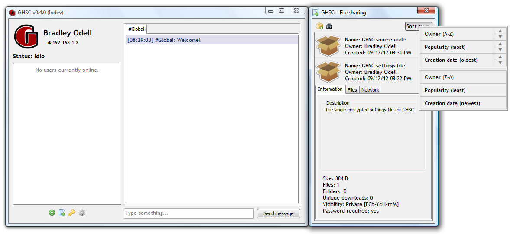

# GHSC: Glencoe High School Chat
> A local area network communications application.

## Overview

**GHSC** is an ever-growing communication program which allows multiple individuals 
to talk over any local network (such as a home network). 
It is written in the **Java programming language**. 
The source code consists of over **13,000 lines of code**.

## Features

1. User-friendly interactive GUI (graphical user interface).
2. Saves settings in a user profile.
3. Independent chat rooms called "channels". Functions similar to IRC (Internet relay chat).
4. Spam control.
5. Automatic application updating.

## Future Features

1. File sharing
2. Improve network security by using public key encryption and SSL sockets instead of 
   a hardcoded AES secret key (*yikes!*)
3. Private messaging (messaging outside of channels)
4. Image and link integration into chat area
5. Screen sharing

## History

**Bradley Odell** started development in early 2012 when he was **15 years old**.
The program's main goal was to allow students attending school to chat in class or 
even between classrooms using the school's network.
GHSC stands for "Glencoe High School Chat", named after the high school Bradley attended.

The project was originally closed source with compiled and obfuscated binaries being available here:
https://code.google.com/archive/p/ghsc/

It was open-sourced to GitHub on August 22nd, 2018: https://github.com/BTOdell/GHSC

## Development Status

Currently working on: **File sharing** (Estimated 60% complete)

